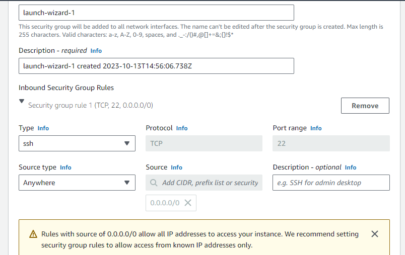
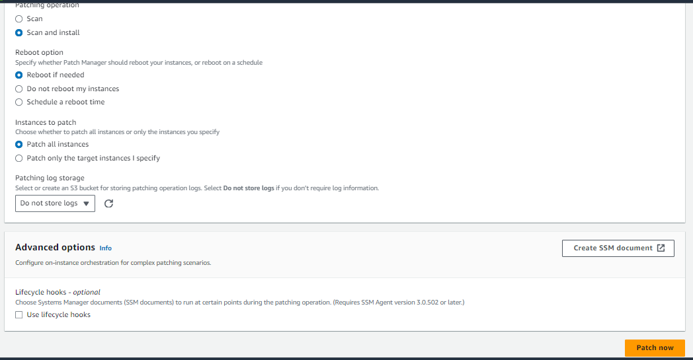
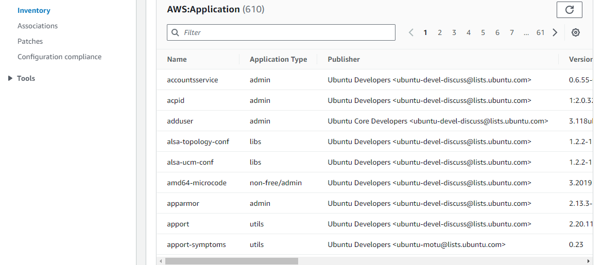
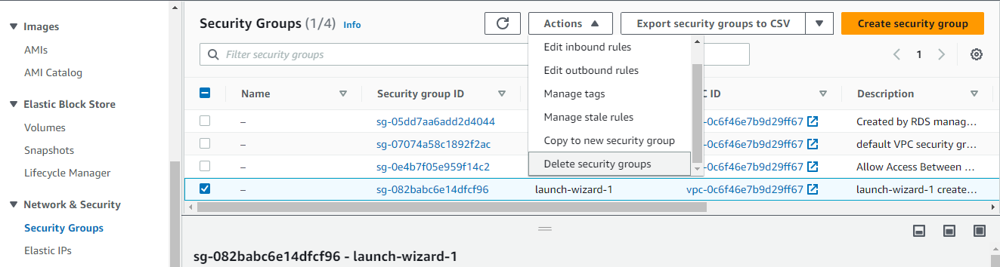

# Systems Manager

## Overview

This project provides instructions for launching two instances, one with Amazon Linux 2 and one with Ubuntu 20.04. The instances can be accessed using Session Manager. The project demonstrates the use of Systems Manager features such as Patch Manager to apply OS updates and Run Command to execute shell commands across the instances.

The environment will be created in the us-east-1 (North Virginia) region. Please note that if you deploy the project in a different region, make sure to adjust the links accordingly.

*Note:* This demo uses slightly older AMIs due to errors encountered when patching with Patch Manager on Amazon Linux 2023 and Ubuntu 22.04 at the time of writing. 

*Update:* Starting from March 23rd, Amazon Linux 2023 is supported, but Ubuntu 22.04 is not. For a list of supported operating systems, please refer to the [documentation](https://docs.aws.amazon.com/systems-manager/latest/userguide/patch-manager-prerequisites.html#supported-os).

## Instructions

### Stage 1 - Creating IAM roles

1. Open the IAM console by visiting [https://us-east-1.console.aws.amazon.com/iamv2/home](https://us-east-1.console.aws.amazon.com/iamv2/home).

2. Go to Roles and click on "Create role".

3. Select "AWS service" and choose "EC2".

   

4. Click "Next".

5. On the Add Permissions page, search for and select "AmazonSSMManagedInstanceCore".

   

6. Click "Next".

7. Set the "Role Name" to "Demo-SSM-Role".

8. Click "Create role".

### Stage 2 - Launch the Ubuntu instance

1. Open the EC2 console by visiting [https://us-east-1.console.aws.amazon.com/ec2/home](https://us-east-1.console.aws.amazon.com/ec2/home).

   *Note:* You can create these instances in any VPC or Subnet. However, ensure that the instance has internet access to reach the SSM endpoints. The default VPC has an Internet Gateway, so we will be using that.

2. Go to "Instances" and click "Launch instances".

   

3. Set the "Name" to "ubuntu".

   

4. Under "Application and OS Images", select "Ubuntu".

5. Click the dropdown menu and select "Ubuntu Server 20.04 LTS (HVM)".

   

6. Leave the "Instance Type" as "t2.micro" or "t3.micro" (whichever is default). Under "Key pair (login)", select "Proceed without a key pair".

7. Under "Network settings", click "Edit".

8. Change "Auto-assign public IP" to "Enable".

9. Take note of the security group name that is being created as we will delete it in the clean-up stage.

   

10. Expand the "Advanced details" section and under "IAM instance profile", select the role you created in stage 1.

    

11. Click on "Launch instance".
	
## Stage 3 - Launching the Amazon Linux 2 Instance

To begin the process of launching an Amazon Linux 2 instance, follow these steps:

1. Access the EC2 console by navigating to [https://us-east-1.console.aws.amazon.com/ec2/home](https://us-east-1.console.aws.amazon.com/ec2/home).
2. Proceed to the *Instances* section and click on the *Launch instances* button.

3. Assign the name "al2" to the instance.

	

4. In the *Application and OS Images* section, choose "Amazon Linux".

5. From the dropdown menu, select the option for `Amazon Linux 2 AMI (HVM)`.

	

6. Keep the *Instance Type* as either "t2.micro" or "t3.micro" (whichever is the default). For the *Key pair (login)* option, select "Proceed without a key pair".

7. Under *Network settings*, click on the *Edit* button.

8. Set *Auto-assign public IP* to "Enable".

9. In the *Firewall (security groups)* section, choose "Select existing security group" and select the security group that was created in stage 2.

	

10. Expand the *Advanced details* and select the role you created in stage 1 under *IAM instance profile*.

	

11. Finally, click on the *Launch instance* button.

## Stage 4 - Viewing Instances in Systems Manager

To view the instances in Systems Manager, follow these steps:

1. Go to the Systems Manager console by visiting [https://us-east-1.console.aws.amazon.com/systems-manager](https://us-east-1.console.aws.amazon.com/systems-manager).
2. Navigate to *Fleet Manager*.

	

3. The two instances that were created should already be detected and adopted by Systems Manager.

	

4. If you don't see your instances listed here, it could be due to reasons such as the subnet where the instances were launched lacking internet access, the security group not having outbound port 443 access, the instance role not being attached (which allows access to Systems Manager), or the instance still being in the process of starting up.
5. On the Fleet Manager page, click on either of the instances.

6. On the next page, you can observe the Operating System installed, the running SSM agent version, and the SSH key used (if one was set).

	

7. By navigating to the *File system* section, you can browse the instance's file system, perform actions such as cutting, copying, or deleting files, as well as read or tail files.

	

Note: For the purpose of this demo, we won't be performing these actions, but it serves as an example of the capabilities offered by Fleet Manager.

## Stage 5 - Updating Packages on Instances using Patch Manager

To update packages on your instances using Patch Manager, follow these steps:

1. Access the EC2 console by visiting [https://us-east-1.console.aws.amazon.com/ec2/home](https://us-east-1.console.aws.amazon.com/ec2/home).
2. Navigate to the *Instances* section and select your `ubuntu` instance. Click on the <kbd>Connect</kbd> button.

	

3. Under the *Session Manager* tab, click on <kbd>Connect</kbd>.

	

This action will open a shell window that allows you to run commands similar to an SSH connection.

4. In the shell window, execute the following command:

```python
sudo apt update && sudo apt upgrade
```


This command updates the package repository cache on the server (`apt update`) and upgrades any installed packages to the latest available versions in the package repository (`apt upgrade`).

5. The displayed square box presents a list of packages that would be upgraded if you proceed. Note that your output may differ as the available upgrade packages change over time.

	

6. Type `n` and press <kbd>Enter</kbd>. This step ensures that no packages are upgraded using this method. It serves to demonstrate the presence of pending updates.

7. Keep the shell window open and open a new tab or window. Visit the Systems Manager console at [https://us-east-1.console.aws.amazon.com/systems-manager](https://us-east-1.console.aws.amazon.com/systems-manager).

8. Go to *Patch Manager* and click on <kbd>Start with an overview</kbd>. For this demonstration, you don't need to create a patch policy.

	

9. On the following page, click on <kbd>Patch now</kbd>.

	

10. Change the *Patching operation* to "Scan and install" and the *Patching log storage* to "Do not store logs" (not required for this demo).

	

11. Click on <kbd>Patch now</kbd>.

Please note that this process may take a few minutes, and the page will automatically refresh until the process is complete.

12. Once the process finishes, return to the previously opened shell tab and run the same command again:

	```python
	sudo apt update && sudo apt upgrade
	```

This time, you should observe a smaller list of packages to be upgraded or no packages with available upgrades. This outcome demonstrates the effectiveness of Patch Manager. We will now explore how Patch Manager achieved this.

13. Return to the Patch Manager tab and click on the "Association ID".

	

14. Proceed to the *Versions* tab and take note of the Document Name.

	

This Document Name represents the Systems Manager document used (by default) for patching instances. Let's delve into the details of this document.

15. Click on *Documents* on the left panel and search for "AWS-RunPatchBaseline".

	

16. Select the document name.

	

17. Navigate to the *Content* tab.

	

Documents are JSON or YAML files containing instructions for executing actions on instances. Amazon provides numerous managed documents for various tasks, such as patching instances, running custom shell scripts, setting instance tags, and more.

18. In the "AWS-RunPatchBaseline" document, you can observe that the script checks the operating system type and executes the relevant commands to update the operating system. Examples are provided for Windows, Linux, and MacOS.

Windows:

	

Linux:

	

MacOS:

	

19. Return to the Patch Manager, click on "AWS-PatchNowAssociation" and then click on the Execution ID.

	

20. On the subsequent page, click on "Output" next to any of the updated instances.

	

21. In the Output page, you can examine the output and errors generated by the executed document(s). For instance, the "AWS-RunPatchBaseline" document comprises three steps: `PatchWindows`, `PatchLinux`, and `PatchMacOS`.

	

All these steps are marked as "Success," despite the Linux instances being executed. This outcome occurs because if any step in the document fails, Systems Manager terminates the entire execution. The Output window shows that the `PatchWindows` and `PatchMacOS` steps were skipped (considered successful) in this case.

22. If you navigate to the `PatchLinux` step and expand the Output pane, you can review the shell output generated during the document execution.

	

23. By expanding the Error pane, you can examine any errors encountered during the execution. In this scenario, a few warnings were encountered, but no errors significant enough to cancel the execution.

	
	
## Stage 6 - Executing Commands with Run Command

To proceed with executing commands using the Run Command feature, follow these steps:

1. Access the Systems Manager console at the following URL: [https://us-east-1.console.aws.amazon.com/systems-manager](https://us-east-1.console.aws.amazon.com/systems-manager).

2. Navigate to the *Run Command* section and click on the <kbd>Run command</kbd> button.

	

3. On the subsequent page, you will find a list of command documents. As mentioned in the previous stage, these documents contain instructions regarding the actions to be performed on an instance.

4. In the search bar, enter "AWS-RunShellScript" to locate the corresponding command document.

	

5. The "AWS-RunShellScript" document, provided and managed by Amazon, enables you to execute custom shell commands on multiple instances simultaneously. This capability can be especially beneficial in large organizations with numerous instances, saving considerable time.

6. In the *Commands* section, enter the following command:

	```python
	sudo touch /hello_from_systems_manager
	sudo useradd -c "Elon Musk" emusk
	```
	
	

This command will create a file called `hello_from_systems_manager` in the root directory ("/") and add a user with the username "emusk".

7. Under *Target selection*, choose "Choose instances manually" and select all instances (both of them). In a production environment, it is possible to execute this command selectively on specific instances based on their tags or by utilizing resource groups (e.g., dev instances versus production instances).

	

8. In the *Output options* section, deselect "Enable an S3 bucket." Storing the command output is unnecessary for this specific command.

	

9. Leave all other options unchanged and click on the <kbd>Run</kbd> button.

10. The execution of the command should complete quickly. On the subsequent page, you will be able to see the command's status.

	

11. To validate the command's execution, proceed to the EC2 console by accessing the following URL: [https://us-east-1.console.aws.amazon.com/ec2/home](https://us-east-1.console.aws.amazon.com/ec2/home).

12. Navigate to the *Instances* section, select any instance, and click on the <kbd>Connect</kbd> button.

13. Within the *Session Manager* tab, click on the <kbd>Connect</kbd> button.

	

14. This will open a shell window, allowing you to execute commands similar to connecting via SSH.

15. To confirm the success of the command, you can perform the following checks. Firstly, verify the creation of the file by running the command:

```python
ls -l /
```

The created file should be listed.


16. Secondly, verify the creation of the user by running the command:

	```python
	sudo tail /etc/passwd
	```

The newly created user should be displayed.


## Stage 7 - Viewing Aggregated Instance Data with Inventory

To view aggregated instance data using the Inventory feature, follow these steps:

1. Access the Systems Manager console at the following URL: [https://us-east-1.console.aws.amazon.com/systems-manager](https://us-east-1.console.aws.amazon.com/systems-manager).

2. Go to the *Inventory* section and click on "Click here to enable inventory on all instances."

3. This action will provide you with a summarized view of the operating system versions, installed applications, and other relevant details across all managed instances in Systems Manager.

4. Scroll down and click on one of the instances created earlier.

	

5. Navigate to the *Inventory* tab to access detailed information about that specific instance.

6. From this tab, you can view the installed applications on the selected instance.

	

7. Furthermore, you can access networking information.

	

8. Hardware information is also available for review.

	

9. Additionally, you can explore various other pieces of information related to the instance.

## Stage 8 - Cleanup

To perform the cleanup tasks for this project, follow the steps below:

1. Access the EC2 console by visiting the following link: [https://us-east-1.console.aws.amazon.com/ec2/home](https://us-east-1.console.aws.amazon.com/ec2/home).

2. In the EC2 console, navigate to the *Instances* section.

3. Select both the "al2" and "ubuntu" instances.

4. Click on the <kbd>Instance state</kbd> button, and then choose <kbd>Terminate Instance</kbd>.

5. Exercise caution to ensure that you only delete the instances created during this demo.

   

6. Now, proceed to the *Security Groups* section in the EC2 console.

7. Locate the "launch-wizard-1" security group (or the name of the security group created in stage 2).

8. Click on the <kbd>Actions</kbd> button, and then select <kbd>Delete security groups</kbd>.

   

9. Confirm the deletion by clicking on the <kbd>Delete</kbd> button in the confirmation window.

10. Next, navigate to the IAM console using the following link: [https://us-east-1.console.aws.amazon.com/iamv2/home](https://us-east-1.console.aws.amazon.com/iamv2/home).

11. In the IAM console, go to the *Roles* section.

12. Search for the "Demo-SSM-Role" role that we created in stage 1.

13. Select the "Demo-SSM-Role" and click on the <kbd>Delete</kbd> button.

   

14. Enter "Demo-SSM-Role" in the confirmation box, and then click on <kbd>Delete</kbd> to confirm the deletion.

15. Finally, note that managed instances are automatically removed from AWS Systems Manager, so no additional cleanup is required in that area.
